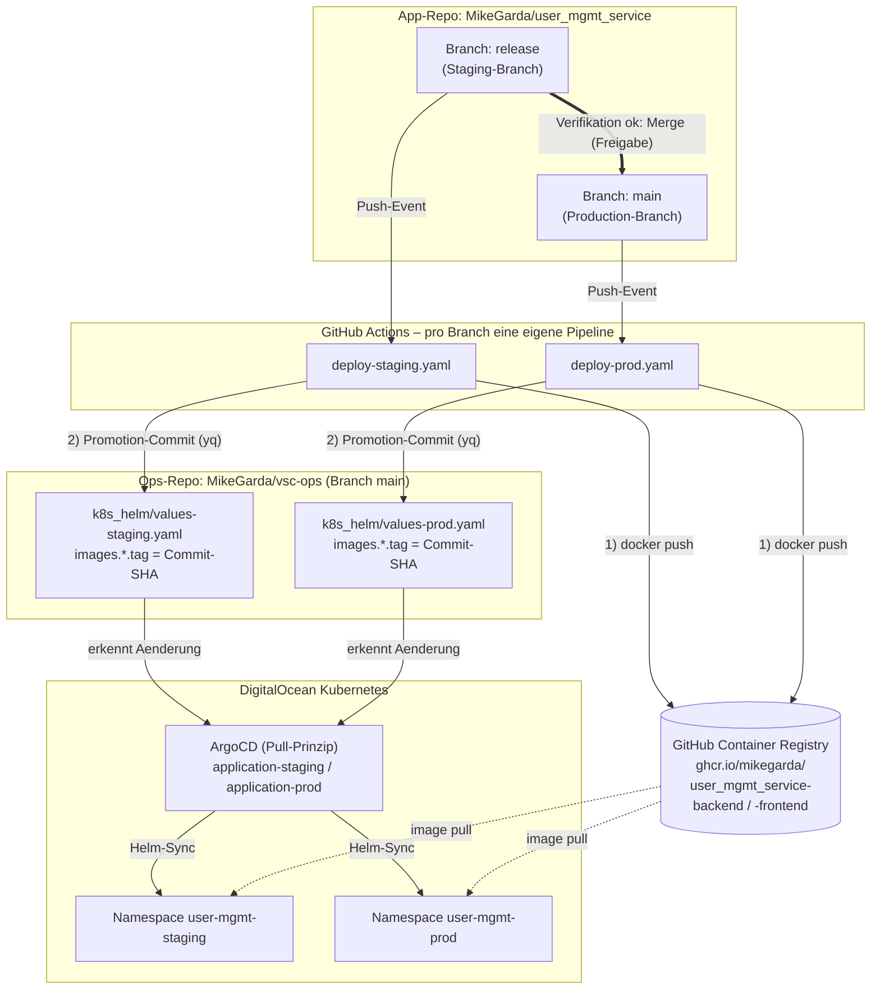
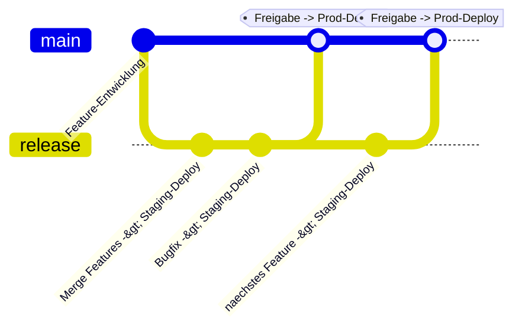

# vsc-ops – GitOps-/Operations-Repository

**Single Source of Truth** für den Betrieb des `user_mgmt_service` auf
DigitalOcean Kubernetes (DOKS): ArgoCD-Applications, Helm-Chart inkl.
Values, Monitoring-Konfiguration und Bootstrap-Skript liegen versioniert
in diesem Repo. Deployt wird **nie manuell** – ausschliesslich über die
**GitHub-Pipelines** im App-Repo und den ArgoCD-Sync (Pull-Prinzip).

## Übersicht

| Repository | Rolle |
| --- | --- |
| [MikeGarda/user_mgmt_service](https://github.com/MikeGarda/user_mgmt_service) | App-Code (Spring Boot Backend, Next.js Frontend) + GitHub-Pipelines |
| [MikeGarda/vsc-ops](https://github.com/MikeGarda/vsc-ops) | Dieses Repo: GitOps-State (ArgoCD, Helm, Monitoring, Bootstrap) |

## Dokumentationen
- [Prometheus](docs/Prometheus.md)

## Branch-Modell

Das Deployment läuft über **zwei Branches im App-Repo**; pro Branch gibt
es **eine eigene Pipeline-Datei**:

| Branch (App-Repo) | Rolle | Pipeline (App-Repo) | Umgebung | Promotion-Ziel in diesem Repo | Namespace |
| --- | --- | --- | --- | --- | --- |
| `release` | Staging-Branch | `.github/workflows/deploy-staging.yaml` | Staging | `k8s_helm/values-staging.yaml` | `user-mgmt-staging` |
| `main` | Production-Branch | `.github/workflows/deploy-prod.yaml` | Production | `k8s_helm/values-prod.yaml` | `user-mgmt-prod` |

Beide ArgoCD-Applications (`application-staging.yaml`,
`application-prod.yaml`) beobachten dabei den Branch `main` **dieses**
Ops-Repos; die Trennung der Umgebungen erfolgt ausschliesslich über die
Values-Dateien.

## Deployment-Prozess (Visualisierung)



### Ablauf im Detail

1. Features entstehen auf Feature-Branches und werden per Pull Request
   nach `release` gemergt.
2. Jeder Push auf `release` startet `deploy-staging.yaml`:
   1. **Build**: Backend- und Frontend-Image werden gebaut und nach
      GHCR gepusht. Als Tag dient der kurze Commit-SHA (unveränderlich).
      Auf einen `latest`-Tag wird bewusst verzichtet, damit sich die
      beiden Branch-Pipelines nicht gegenseitig überschreiben.
   2. **Promotion**: Die Pipeline schreibt den neuen Tag mit `yq` in
      `k8s_helm/values-staging.yaml` und committet die Änderung auf den
      Branch `main` dieses Repos (Secret `OPS_REPO_TOKEN`).
   3. **Sync**: ArgoCD (Application `user-mgmt-staging`) erkennt die
      Änderung und rollt das neue Image automatisch in den Namespace
      `user-mgmt-staging` aus (automated sync mit prune + self-heal).
3. Staging wird verifiziert (z. B. per Port-Forward; ab Aufgabe 2
   zusätzlich per k6-Lasttest gegen Staging).
4. Der Merge von `release` nach `main` ist die Freigabe für Production
   und löst `deploy-prod.yaml` aus – identischer Mechanismus gegen
   `values-prod.yaml` bzw. Namespace `user-mgmt-prod`.

### Promotionspfad (Release-Prozess)



## Pipelines im Detail

Beide Dateien sind identisch aufgebaut und unterscheiden sich nur in
Trigger, Umgebung und Ziel-Values-Datei:

| Schritt | Aktion |
| --- | --- |
| Tag ermitteln | Kurzer Commit-SHA (`${GITHUB_SHA::7}`) als Image-Tag |
| GHCR-Login | `docker/login-action` mit `GITHUB_TOKEN` (`packages: write`) |
| Build & Push | Backend (`./Dockerfile`) und Frontend (`./src-ui/Dockerfile`) via `docker/build-push-action` |
| Promotion | `yq`-Update von `images.backend.tag` / `images.frontend.tag` in der Values-Datei, Commit + Push in dieses Repo |

Zusätzliche Mechanismen:

- `workflow_dispatch`: Jede Pipeline lässt sich zusätzlich manuell auslösen.
- `concurrency`: Pro Umgebung läuft höchstens ein Deployment gleichzeitig.
- `environment: staging` / `environment: production`: GitHub-Environments
  für Übersicht und optional manuelle Freigabe-Gates (z. B. für Production).

## Repository-Struktur

```
vsc-ops/
├── README.md                                   # Diese Doku
├── setup-gitops.ps1                            # Bootstrap: DOKS, Ingress, ArgoCD, Secrets, Applications
├── application-staging.yaml                    # ArgoCD-Application -> Namespace user-mgmt-staging
├── application-prod.yaml                       # ArgoCD-Application -> Namespace user-mgmt-prod
├── application-monitoring.yaml                 # ArgoCD-Application -> kube-prometheus-stack (monitoring)
├── argocd-repository-prometheus-community.yaml # Helm-Repo-Registrierung in ArgoCD
├── k8s_helm/                                   # Helm-Chart der Anwendung
│   ├── Chart.yaml
│   ├── values.yaml                             # Basiswerte (Defaults)
│   ├── values-staging.yaml                     # Staging-Overrides + CI-verwaltete Image-Tags
│   ├── values-prod.yaml                        # Prod-Overrides + CI-verwaltete Image-Tags
│   └── templates/
│       ├── backend.yaml, frontend.yaml, db.yaml    # Deployments + Services
│       ├── configmap.yaml, ingress.yaml            # Konfiguration; Ingress nur in Prod aktiv
│       ├── hpa.yaml, pdb.yaml                      # Autoskalierung/Verfügbarkeit (Aufgabe 2/6)
│       ├── resourcequota.yaml, networkpolicy.yaml  # Namespace-Isolation (Aufgabe 5)
│       └── servicemonitor.yaml                     # Applikationsmetriken (Aufgabe 1)
└── monitoring/
    ├── values.yaml                             # Eigene Values für den kube-prometheus-stack
    └── grafana-dashboards.yaml                 # Grafana-Dashboard-Provisioning
```

## Voraussetzungen & Secrets

| Secret | Ort | Zweck |
| --- | --- | --- |
| `OPS_REPO_TOKEN` | App-Repo (GitHub Secrets) | Schreibzugriff auf dieses Repo für den Promotion-Commit |
| `GITHUB_TOKEN` | automatisch | Push der Images nach GHCR |
| `app-secret` | Cluster, je Namespace | `SPRING_DATASOURCE_PASSWORD`, `JWT_SECRET` (via `setup-gitops.ps1`) |
| `grafana-admin-credentials` | Cluster, Namespace `monitoring` | Grafana-Login (kein Plaintext im Repo) |

## Bootstrap (Ersteinrichtung)

```powershell
.\setup-gitops.ps1 -ClusterName teko-doks -CreateCluster   # Cluster neu anlegen
.\setup-gitops.ps1 -ClusterName teko-doks                  # bestehender Cluster
```

Das Skript installiert: DOKS-Kontext, nginx-Ingress-Controller,
metrics-server (Basis für den HPA), ArgoCD, das prometheus-community-Helm-Repo,
die Cluster-Secrets und alle ArgoCD-Applications (staging, prod, monitoring).

## Betrieb & Verifikation

```bash
# Staging hat keinen Ingress -> Port-Forward:
kubectl port-forward svc/frontend -n user-mgmt-staging 3000:3000
kubectl port-forward svc/backend  -n user-mgmt-staging 8080:8080

# Prod läuft über den nginx-Ingress:
kubectl get ingress -n user-mgmt-prod

# Sync-Status in ArgoCD prüfen:
kubectl port-forward svc/argocd-server -n argocd 8080:443
kubectl -n argocd get applications
```

## Vorbereitung auf die Aufgaben 2–6

| Aufgabe | Thema | Vorbereitung |
| --- | --- | --- |
| 2 | k6-Lasttest & HPA-Verifikation | In `deploy-staging.yaml` ist der Job-Slot `load-test` vorbereitet: Er läuft nach der Promotion gegen Staging, wartet den ArgoCD-Sync ab und führt das k6-Skript aus. HPA- und PDB-Manifeste liegen bereits im Chart (`templates/hpa.yaml`, `templates/pdb.yaml`). |
| 3 | Terraform (IaC) | Infrastruktur-Definitionen werden in diesem Repo ergänzt (z. B. Verzeichnis `terraform/`) und sind von den App-Pipelines unabhängig; Secrets (DO-Token) bleiben ausserhalb des Repos. |
| 4 | Managed PostgreSQL | Zugangsdaten laufen weiterhin über das Cluster-Secret `app-secret` – keine Credentials in Pipeline oder Repo. Bei der Umstellung werden die `db`-Manifeste im Chart entfernt und die Verbindungsdaten der Managed DB ins Secret übernommen. |
| 5 | Kyverno | ClusterPolicies werden deklarativ in diesem Repo abgelegt (z. B. Verzeichnis `policies/`). Die Enforcement erfolgt beim Admission im Cluster und gilt damit automatisch für beide Umgebungen/Pipelines. |
| 6 | module_service | In beiden Pipelines vorbereitet: Umgebungsvariable `MODULE_IMAGE`, Build-Step und Promotion-Zeile (`.images.module.tag`). Deployment/Service des module_service kommen ergänzend ins Helm-Chart. |

