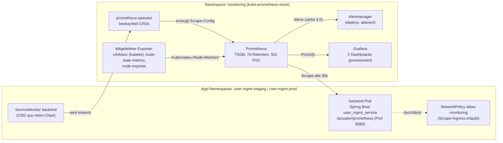
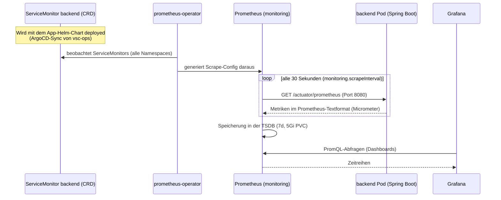
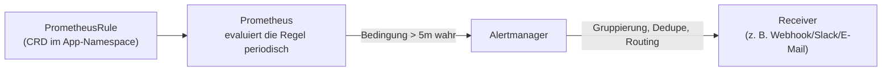
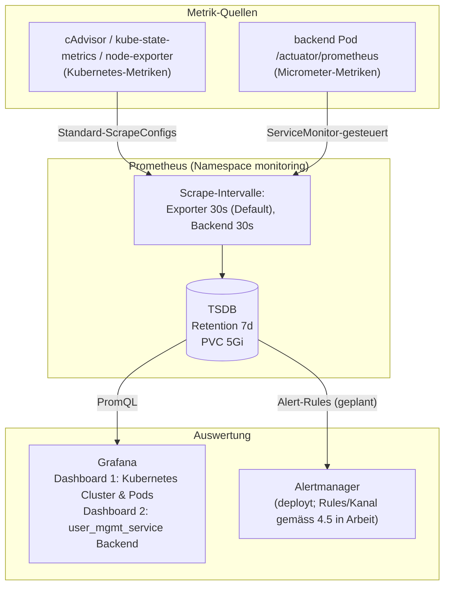

# Prometheus & Monitoring – Dokumentation (Aufgabe 1)

> **Modul:** Orchestrierung & Observability · **Aufgabe 1**
> **Repositories:** [`MikeGarda/vsc-ops`](https://github.com/MikeGarda/vsc-ops) (Ops/GitOps) · [`MikeGarda/user_mgmt_service`](https://github.com/MikeGarda/user_mgmt_service) (App)
> **Monitoring-Stack:** `prometheus-community/kube-prometheus-stack` (Chart-Version `83.6.0`, gepinnt) · Namespace `monitoring`

Diese Dokumentation erklärt, wie die Prometheus-Überwachung für den
`user_mgmt_service` auf dem DigitalOcean-Kubernetes-Cluster (DOKS) umgesetzt
wurde. Jeder Teilpunkt aus Aufgabe 1 wird einzeln beschrieben – inklusive der
zugehörigen Dateien, Konfigurationsauszüge und der verwendeten PromQL-Abfragen.

---

## Inhaltsverzeichnis

1. [Übersicht & Zielsetzung](#1-übersicht--zielsetzung)
2. [Architektur](#2-architektur)
3. [Statusübersicht der Teilaufgaben](#3-statusübersicht-der-teilaufgaben)
4. [Umsetzung im Detail](#4-umsetzung-im-detail)
   1. [Installation des kube-prometheus-stack via Helm im Namespace `monitoring`](#41-installation-des-kube-prometheus-stack-via-helm)
   2. [CPU- und Memory-Auslastung pro Pod](#42-cpu--und-memory-auslastung-pro-pod)
   3. [Applikationsmetriken & ServiceMonitor](#43-applikationsmetriken--servicemonitor)
   4. [Zwei Grafana-Dashboards](#44-zwei-grafana-dashboards)
   5. [PrometheusRule & Alertmanager](#45-prometheusrule--alertmanager)
   6. [Deklarative Konfiguration über eine eigene `values.yaml` im Ops-Repo](#46-deklarative-konfiguration-über-eigene-valuesyaml-im-ops-repo)
5. [Datenfluss: Scrape → Speicherung → Visualisierung](#5-datenfluss-scrape--speicherung--visualisierung)
6. [Betrieb & Verifikation](#6-betrieb--verifikation)
7. [Dateiindex](#7-dateiindex)

---

## 1. Übersicht & Zielsetzung

Aufgabe 1 verlangt eine vollständige Observability-Basis für den
`user_mgmt_service`:

- Ein **Monitoring-Stack** (Prometheus, Grafana, Alertmanager) wird per Helm
  in einem **dedizierten Namespace `monitoring`** installiert.
- **Kubernetes-Basismetriken** (CPU/Memory pro Pod) werden überwacht.
- Die **Spring-Boot-Anwendung** stellt kompatible Metriken bereit
  (Actuator + Micrometer) und wird per **ServiceMonitor** gescrapt –
  erfasst werden mindestens **Request Rate**, **Response Time** und
  **Error Rate** (RED-Prinzip).
- **Zwei Grafana-Dashboards** visualisieren die Telemetriedaten.
- Für das Backend ist eine **PrometheusRule** mit Alertmanager-Anbindung
  vorgesehen (siehe [4.5](#45-prometheusrule--alertmanager) zum aktuellen Stand).
- Die gesamte Konfiguration liegt **deklarativ im Ops-Repository**
  (GitOps, Single Source of Truth).

**RED-Prinzip** – die drei Kernkennzahlen für HTTP-Dienste:

| Kennzahl | Bedeutung | Metrik/Abfrage (Basis) |
| --- | --- | --- |
| **R**equest Rate | Wie viele Requests pro Sekunde kommen an? | `rate(http_server_requests_seconds_count[1m])` |
| **R**esponse Time | Wie schnell antwortet der Dienst? | `histogram_quantile(…, http_server_requests_seconds_bucket)` |
| **E**rror Rate | Wie viele Requests schlagen fehl? | `rate(…{status=~"5.."}[5m]) / rate(…[5m])` |

---

## 2. Architektur



Kernidee: Der Stack läuft **zentral** im Namespace `monitoring`, während die
Anwendung in `user-mgmt-staging` bzw. `user-mgmt-prod` deployed ist. Die
Brücke zwischen beiden Welten bilden die CRDs des prometheus-operator
(`ServiceMonitor`) sowie gezielte Operator-Einstellungen und eine
NetworkPolicy-Ausnahme (Details in [4.3](#43-applikationsmetriken--servicemonitor)).

---

## 3. Statusübersicht der Teilaufgaben

| # | Anforderung (Aufgabe 1) | Status | Umsetzung |
| - | --- | --- | --- |
| 1 | kube-prometheus-stack via Helm in Namespace `monitoring` | ✅ umgesetzt | ArgoCD-Application `application-monitoring.yaml`, Chart gepinnt (`83.6.0`) – [4.1](#41-installation-des-kube-prometheus-stack-via-helm) |
| 2 | CPU- und Memory-Auslastung pro Pod überwachen | ✅ umgesetzt | cAdvisor/kube-state-metrics/node-exporter (im Stack enthalten) + Dashboard 1 – [4.2](#42-cpu--und-memory-auslastung-pro-pod) |
| 3 | Spring-Boot-Metriken + ServiceMonitor (Request Rate, Response Time, Error Rate) | ✅ umgesetzt | Actuator/Micrometer in der App + `templates/servicemonitor.yaml` – [4.3](#43-applikationsmetriken--servicemonitor) |
| 4 | Zwei Grafana-Dashboards | ✅ umgesetzt | `monitoring/grafana-dashboards.yaml` (ConfigMap-Provisioning) – [4.4](#44-zwei-grafana-dashboards) |
| 5 | PrometheusRule + Alert an Benachrichtigungskanal | 🚧 Grundlage geschaffen | Alertmanager deployed + Rule-Selector offen; **eigene Rule und Receiver fehlen noch im Repo** – [4.5](#45-prometheusrule--alertmanager) |
| 6 | Deklarative `values.yaml` im Ops-Repo | ✅ umgesetzt | `monitoring/values.yaml` + `monitoring/grafana-dashboards.yaml` – [4.6](#46-deklarative-konfiguration-über-eigene-valuesyaml-im-ops-repo) |

---

## 4. Umsetzung im Detail

### 4.1 Installation des kube-prometheus-stack via Helm

**Anforderung:** *kube-prometheus-stack ist mittels Helm in einem dedizierten
Namespace namens `monitoring` installiert.*

Der Stack wird **nicht manuell per `helm install`** ausgerollt, sondern über
den bestehenden GitOps-Prozess: Eine ArgoCD-Application installiert das
Helm-Chart deklarativ. Damit ist die Installation versioniert, reproduzierbar
und drift-frei (automatischer Re-Sync bei Abweichungen).

**Beteiligte Dateien (vsc-ops):**

| Datei | Zweck |
| --- | --- |
| `argocd-repository-prometheus-community.yaml` | Registriert das Helm-Repo `prometheus-community` in ArgoCD (Secret vom Typ `repository`) |
| `application-monitoring.yaml` | ArgoCD-**Multi-Source**-Application: Chart + eigene Values |
| `setup-gitops.ps1` (Schritt 3b/4b/5) | Bootstrap: Repo-Registrierung, Namespace + Grafana-Secret, Apply der Application |

**Auszug aus `application-monitoring.yaml`:**

```yaml
apiVersion: argoproj.io/v1alpha1
kind: Application
metadata:
  name: monitoring
  namespace: argocd
spec:
  sources:
    # 1) Helm-Chart kube-prometheus-stack (Version gepinnt -> reproduzierbares GitOps)
    - repoURL: https://prometheus-community.github.io/helm-charts
      chart: kube-prometheus-stack
      targetRevision: 83.6.0
      helm:
        releaseName: kube-prometheus-stack
        valueFiles:
          - $ops/monitoring/values.yaml
          - $ops/monitoring/grafana-dashboards.yaml
    # 2) Eigene values.yaml aus dem Ops-Repository (ref "ops")
    - repoURL: https://github.com/MikeGarda/vsc-ops.git
      targetRevision: main
      ref: ops
  destination:
    server: https://kubernetes.default.svc
    namespace: monitoring
  syncPolicy:
    automated: { prune: true, selfHeal: true }
    syncOptions:
      - CreateNamespace=true
      # Die CRDs des Stacks sind zu gross fuer Client-Side-Apply
      # (Annotation-Limit) -> Server-Side-Apply verwenden.
      - ServerSideApply=true
```

**Wichtige Umsetzungsdetails:**

1. **Multi-Source-Application:** Quelle 1 ist das externe Helm-Chart, Quelle 2
   das Ops-Repo (über den Referenznamen `ops`). Die `valueFiles` verweisen mit
   `$ops/...` auf die eigenen Values-Dateien – Chart und Konfiguration sind so
   sauber getrennt.
2. **Gepinnte Chart-Version (`83.6.0`):** Ein Update des Stacks ist eine
   bewusste, versionierte Änderung im Repo – kein automatisches Nachziehen.
3. **`CreateNamespace=true`:** ArgoCD legt den Namespace `monitoring` selbst an;
   der Stack bleibt in einem **dedizierten Namespace** isoliert.
4. **`ServerSideApply=true`:** Die CRDs des Stacks
   (`monitoring.coreos.com/v1`, z. B. `ServiceMonitor`) überschreiten das
   Annotation-Grössenlimit von Client-Side-Apply; Server-Side-Apply umgeht das.
5. **`automated.prune/selfHeal`:** Manuelle Änderungen am Cluster werden
   automatisch auf den Git-Zustand zurückgeführt.
6. **Mitinstallierte Komponenten des Charts:** Prometheus (Server + TSDB),
   Alertmanager, Grafana, prometheus-operator (inkl. CRDs), node-exporter und
   kube-state-metrics. Die cAdvisor-Metriken stammen aus den kubelets und
   werden über die Standard-ScrapeConfigs des Stacks erfasst.

---

### 4.2 CPU- und Memory-Auslastung pro Pod

**Anforderung:** *Für Kubernetes werden mindestens CPU- und Memory-Auslastung
pro Pod durch Prometheus überwacht.*

Hierfür ist **keine Zusatzkonfiguration** nötig: Der kube-prometheus-stack
deployt alle nötigen Datenquellen bereits mit und scrapt sie standardmässig:

| Datenquelle | Herkunft | Wichtige Metriken |
| --- | --- | --- |
| **cAdvisor** (Teil des kubelets) | Ressourcennutzung der Container | `container_cpu_usage_seconds_total`, `container_memory_working_set_bytes` |
| **kube-state-metrics** | Kubernetes-Objektzustände | `kube_pod_container_resource_requests`, `kube_pod_container_resource_limits`, `kube_pod_status_phase`, `kube_pod_container_status_restarts_total` |
| **node-exporter** | Host-Metriken der Worker-Nodes | `node_cpu_seconds_total`, `node_memory_MemAvailable_bytes`, `node_memory_MemTotal_bytes` |

**Warum `container_memory_working_set_bytes`?** Kubernetes bewertet für
OOM-Kills das *Working Set* eines Containers – diese Metrik zeigt also exakt
den Wert, der auch für die Limits relevant ist (reiner RSS oder Cache wären
irreführend). Die CPU-Nutzung wird als `rate()` über den Counter
`container_cpu_usage_seconds_total` berechnet und ergibt Kerne (z. B. `0.25`
= 250m).

Die Überwachung wird im **Dashboard 1 „Kubernetes Cluster & Pods“** sichtbar
gemacht (Details in [4.4](#44-zwei-grafana-dashboards)). Zusätzlich werden
die Backend-Pod-Metriken auch im Anwendungs-Dashboard gezeigt – dort im
direkten Bezug zu Lasttests und HPA (Aufgabe 2).

**Beispiel-PromQL (pro Pod, filterbar nach Namespace/Pod):**

```promql
# CPU-Nutzung je Pod in Kernen
sum(rate(container_cpu_usage_seconds_total{
  namespace=~"$namespace", pod=~"$pod", container!="", container!="POD"
}[5m])) by (pod)

# Memory Working Set je Pod in Bytes
sum(container_memory_working_set_bytes{
  namespace=~"$namespace", pod=~"$pod", container!=""
}) by (pod)
```

> Der Filter `container!=""` blendet die Pause-Infrastruktur-Pods
> (`container="POD"`) aus, damit nicht doppelt gezählt wird.

---

### 4.3 Applikationsmetriken & ServiceMonitor

**Anforderung:** *Der Spring Boot user_mgmt_service stellt kompatible
Applikationsmetriken bereit. Mittels ServiceMonitor werden mindestens
Request Rate, Response Time und Error Rate durch Prometheus erfasst.*

Die Umsetzung verteilt sich auf **zwei Repositories**: Die Anwendung exponiert
die Metriken (App-Repo), der Ops-Weg (ServiceMonitor, Discovery, Netzwerk)
liegt im Ops-Repo.



#### 4.3.1 App-Seite: Actuator + Micrometer (user_mgmt_service)

**`build.gradle` – Abhängigkeiten:**

```gradle
// Orchestrierung & Observability / Aufgabe 1: Metriken fuer Prometheus (Actuator + Micrometer)
implementation group: 'org.springframework.boot', name: 'spring-boot-starter-actuator', version: '4.1.0-M3'
// Version wird ueber die Spring-Boot-BOM (dependency-management-Plugin) verwaltet.
implementation 'io.micrometer:micrometer-registry-prometheus'
```

- `spring-boot-starter-actuator` stellt die Betriebs-Endpunkte bereit
  (`/actuator/...`).
- `micrometer-registry-prometheus` rendert die Micrometer-Metriken im
  Prometheus-Textformat unter `/actuator/prometheus` – **ohne** eigene
  Metrik-Klassen im Code (Auto-Instrumentierung von Spring MVC, JVM, HikariCP
  usw.).

**`src/main/resources/application.properties` – Freischaltung & Feinschliff:**

```properties
# Actuator-Endpunkte für Kubernetes-Gesundheitschecks und den Prometheus-Scrape freigeben.
management.endpoints.web.exposure.include=health,prometheus
# Histogramm-Buckets für http.server.requests erzeugen, damit Grafana
# Response-Time-Quantile (p50/p95/p99) berechnen kann.
management.metrics.distribution.percentiles-histogram.http.server.requests=true
# Gemeinsamer Tag, um die Metriken des Dienstes in PromQL eindeutig zuordnen zu können.
management.metrics.tags.application=user_mgmt_service
```

| Eigenschaft | Wirkung |
| --- | --- |
| `management.endpoints.web.exposure.include=health,prometheus` | Exponiert **nur** die zwei benötigten Endpunkte – minimale Angriffsfläche |
| `...percentiles-histogram.http.server.requests=true` | Erzeugt `http_server_requests_seconds_bucket`-Histogramme – erst dadurch sind serverseitige Quantile (p50/p95/p99) per `histogram_quantile()` berechenbar |
| `management.metrics.tags.application=user_mgmt_service` | Jede Metrik erhält das Label `application="user_mgmt_service"` zur eindeutigen Zuordnung in PromQL |

**`WebSecurityConfig.java` – Scrape ohne Authentifizierung:**

```java
// Orchestrierung & Observability / Aufgabe 1: Prometheus scrapt /actuator/prometheus ohne Login;
// Health-Checks für Kubernetes-Probes bleiben ebenfalls offen.
.requestMatchers("/actuator/prometheus", "/actuator/health/**").permitAll()
```

Spring Security blockiert standardmässig alle Endpunkte; Prometheus hat keine
Credentials. Deshalb wird **nur** der Metrik- und Health-Pfad freigegeben,
alles andere bleibt JWT-geschützt.

**Resultierende Kernmetriken (Micrometer):**

| Metrik | Typ | Nutzen |
| --- | --- | --- |
| `http_server_requests_seconds_count` | Counter | Request Rate, Error Rate, Statuscode-Verteilung |
| `http_server_requests_seconds_bucket` | Histogramm | Response Time als Quantile |
| `http_server_requests_seconds_sum` | Counter | durchschnittliche Antwortzeit |
| `jvm_memory_used_bytes` | Gauge | JVM-Heap-Auslastung |

Labels pro Sample: `namespace`, `pod`, `uri`, `method`, `status`, `outcome`,
`application` u. a.

#### 4.3.2 Ops-Seite: ServiceMonitor & Discovery (vsc-ops)

**`k8s_helm/templates/servicemonitor.yaml`:**

```yaml
{{- if .Values.monitoring.enabled }}
apiVersion: monitoring.coreos.com/v1
kind: ServiceMonitor
metadata:
  name: backend
  labels:
    {{- include "user-mgmt.labels" . | nindent 4 }}
spec:
  selector:
    matchLabels:
      app.kubernetes.io/name: {{ .Chart.Name }}   # findet den Service "backend"
  namespaceSelector:
    matchNames:
      - {{ .Release.Namespace }}                  # gilt im jeweiligen App-Namespace
  endpoints:
    - port: http                                  # benannter Port des Service
      path: /actuator/prometheus
      interval: {{ .Values.monitoring.scrapeInterval }}   # 30s
{{- end }}
```

**Zugehörige Werte in `k8s_helm/values.yaml`:**

```yaml
monitoring:
  enabled: true          # schaltet den ServiceMonitor ein/aus
  scrapeInterval: 30s    # Scrape-Takt für die Applikationsmetriken
```

Der ServiceMonitor wird **mit dem App-Chart deployed** – also je einmal in
`user-mgmt-staging` und `user-mgmt-prod`. Er überlebt damit automatisch den
gesamten GitOps-Prozess (Pipeline → Values-Promotion → ArgoCD-Sync).

**Warum das nicht „einfach so“ funktioniert – drei nötige Hebel:**

1. **Namespace-übergreifendes Discovery (`monitoring/values.yaml`):**
   Standardmässig akzeptiert der prometheus-operator nur ServiceMonitors, die
   die Labels des eigenen Helm-Releases tragen. Damit Prometheus (Namespace
   `monitoring`) die Monitore aus `user-mgmt-staging`/`user-mgmt-prod`
   überhaupt erkennt, werden die Selektoren geöffnet:

   ```yaml
   prometheus:
     prometheusSpec:
       serviceMonitorSelectorNilUsesHelmValues: false
       podMonitorSelectorNilUsesHelmValues: false
       ruleSelectorNilUsesHelmValues: false
   ```

2. **Benannter Service-Port:** Der ServiceMonitor referenziert den Endpunkt
   über den Port-**Namen** `http`. Der Backend-Service definiert diesen
   explizit (`k8s_helm/templates/backend.yaml`):

   ```yaml
   ports:
     # Benannter Port: der ServiceMonitor referenziert Endpunkte über den Port-Namen.
     - name: http
       port: 8080
       targetPort: 8080
   ```

3. **NetworkPolicy-Ausnahme (`k8s_helm/templates/networkpolicy.yaml`):**
   Die App-Namespaces sind netzwerkisoliert (Aufgabe 5). Eine gezielte
   Ausnahme erlaubt **nur** dem Namespace `monitoring` den Ingress auf den
   Metrik-Port der Backend-Pods – sonst würde der Scrape ins Leere laufen:

   ```yaml
   # 4) Prometheus (Namespace "monitoring") darf die Metrik-Endpunkte des Backends scrapen.
   apiVersion: networking.k8s.io/v1
   kind: NetworkPolicy
   metadata:
     name: allow-monitoring
   spec:
     podSelector:
       matchLabels:
         app: backend
     policyTypes: [Ingress]
     ingress:
       - from:
           - namespaceSelector:
               matchLabels:
                 kubernetes.io/metadata.name: monitoring
         ports:
           - protocol: TCP
             port: 8080
   ```

#### 4.3.3 Auswertung: Request Rate, Response Time, Error Rate

| Kennzahl | PromQL (Dashboard 2) | Erläuterung |
| --- | --- | --- |
| Request Rate | `sum(rate(http_server_requests_seconds_count{uri!~"/actuator/.*"}[1m])) by (uri)` | Requests/s, gesamt und je Endpoint; Actuator-Scrapes werden ausgeblendet, damit sie die Kennzahl nicht verfälschen |
| Response Time | `histogram_quantile(0.95, sum(rate(http_server_requests_seconds_bucket{…}[5m])) by (le))` | p50/p95/p99 aus den Histogramm-Buckets (nur dank `percentiles-histogram=true` möglich) |
| Error Rate | `100 * sum(rate(…{status=~"5.."}[5m])) / sum(rate(…[5m]))` | Anteil HTTP 5xx in Prozent – derselbe Ausdruck speist auch die geplante Alert-Rule ([4.5](#45-prometheusrule--alertmanager)) |

---

### 4.4 Zwei Grafana-Dashboards

**Anforderung:** *In Grafana sind zwei passende Dashboards zur Visualisierung
der Telemetriedaten vorhanden.*

Beide Dashboards sind **als Code** definiert und werden automatisch
provisioniert – ein manuelles Klicken in der Grafana-UI entfällt, die
Dashboards überleben einen Neu-Deployment des Stacks.

**Mechanismus (in `monitoring/grafana-dashboards.yaml`):**

```yaml
grafana:
  enabled: true
  sidecar:
    dashboards:
      # ConfigMaps mit diesem Label werden automatisch als Dashboards geladen.
      enabled: true
      label: grafana_dashboard
    datasources:
      # Name/UID der Prometheus-Datasource fixieren, damit die Dashboards
      # unten die Datenquelle eindeutig referenzieren können.
      defaultDatasourceName: Prometheus
      uid: prometheus
  dashboards:
    kubernetes:
      k8s-cluster-pods:
        folder: Kubernetes
        json: |
          { … Dashboard 1 … }
    backend:
      user-mgmt-backend:
        folder: user_mgmt_service
        json: |
          { … Dashboard 2 … }
```

Das Helm-Chart erzeugt daraus ConfigMaps mit dem Label `grafana_dashboard`;
der Grafana-**Sidecar** des kube-prometheus-stack importiert diese beim Start
(und bei Änderungen) automatisch. Die **fixe Datasource-UID `prometheus`**
stellt sicher, dass die Panels ihre Datenquelle eindeutig finden.

> Die Datei wird von `application-monitoring.yaml` als **zweite values-Datei**
> neben `monitoring/values.yaml` übergeben (Helm merged beide) – so bleibt die
> Stack-Konfiguration (`values.yaml`) von den voluminösen Dashboard-JSONs
> getrennt.

**Sichere Zugangsdaten:** Das Grafana-Login liegt **nicht** im Repo, sondern
im Kubernetes-Secret `grafana-admin-credentials` (beim Bootstrap durch
`setup-gitops.ps1` erzeugt):

```yaml
grafana:
  admin:
    existingSecret: grafana-admin-credentials
    userKey: admin-user
    passwordKey: admin-password
```

Beide Dashboards besitzen die Template-Variablen `$namespace` und `$pod`
(Single-Select bzw. Multi-Select, Default: alle), mit denen sich die Panels
auf eine Umgebung bzw. einzelne Pods filtern lassen. Auto-Refresh: 30s.

#### Dashboard 1: „Kubernetes Cluster & Pods“ (Ordner `Kubernetes`)

Überwacht die Infrastruktur gemäss Teilaufgabe 2 (CPU/Memory pro Pod):

| Panel | Datenbasis | PromQL (Kern) |
| --- | --- | --- |
| Cluster CPU-Auslastung (Nodes) | node-exporter | `1 - avg(rate(node_cpu_seconds_total{mode="idle"}[5m]))` |
| Cluster Memory-Auslastung (Nodes) | node-exporter | `1 - sum(node_memory_MemAvailable_bytes) / sum(node_memory_MemTotal_bytes)` |
| Laufende Pods je Namespace | kube-state-metrics | `sum(kube_pod_status_phase{phase="Running"}) by (namespace)` |
| Pod CPU-Auslastung | cAdvisor | `sum(rate(container_cpu_usage_seconds_total{…}[5m])) by (pod)` |
| Pod Memory-Auslastung (Working Set) | cAdvisor | `sum(container_memory_working_set_bytes{…}) by (pod)` |
| Pod CPU: Auslastung vs. Requests/Limits | cAdvisor + kube-state-metrics | Nutzung + `kube_pod_container_resource_requests/limits{resource="cpu"}` |
| Pod Memory: Auslastung vs. Requests/Limits | cAdvisor + kube-state-metrics | Working Set + `kube_pod_container_resource_requests/limits{resource="memory"}` |
| Pod Restarts | kube-state-metrics | `sum(kube_pod_container_status_restarts_total{…}) by (pod)` – Indikator für CrashLoops/OOM |

#### Dashboard 2: „user_mgmt_service Backend“ (Ordner `user_mgmt_service`)

Zeigt die per ServiceMonitor erfassten Applikationsmetriken (RED + Ressourcen):

| Panel | PromQL (Kern) |
| --- | --- |
| Request Rate | `sum(rate(http_server_requests_seconds_count{uri!~"/actuator/.*"}[1m]))` gesamt + `by (uri)` |
| Response Time (p50/p95/p99) | `histogram_quantile(0.5|0.95|0.99, sum(rate(http_server_requests_seconds_bucket{…}[5m])) by (le))` |
| Error Rate (HTTP 5xx) | `100 * sum(rate(…{status=~"5.."}[5m])) / sum(rate(…[5m]))` mit Schwellwerten gelb ab 1 %, rot ab 5 % |
| Fehler (HTTP 5xx) je URI | `sum(rate(…{status=~"5.."}[1m])) by (uri)` |
| Requests je Statuscode | `sum(rate(…[1m])) by (status)` |
| JVM Heap (belegt) | `sum(jvm_memory_used_bytes{area="heap"}) by (pod)` |
| Backend Pod CPU-Auslastung | `sum(rate(container_cpu_usage_seconds_total{…}[5m])) by (pod)` (Bezug zu Aufgabe 2: Lasttest/HPA) |
| Backend Pod Memory-Auslastung | `sum(container_memory_working_set_bytes{…}) by (pod)` |

---

### 4.5 PrometheusRule & Alertmanager

**Anforderung:** *Für den user_mgmt_service ist eine eigene PrometheusRule
definiert, welche einen fachlich sinnvollen Fehlerzustand erkennt. Der
ausgelöste Alert wird über Alertmanager an einen konfigurierten
Benachrichtigungskanal weitergeleitet.*

**Aktueller Stand: 🚧 Grundlage geschaffen, Rule und Benachrichtigungskanal
sind noch nicht umgesetzt.** Bereits vorhanden sind:

| Baustein | Status | Wo |
| --- | --- | --- |
| Alertmanager deployed & aktiviert | ✅ | `alertmanager.enabled: true` in `monitoring/values.yaml` |
| Prometheus empfängt Rules aus allen Namespaces | ✅ | `ruleSelectorNilUsesHelmValues: false` in `monitoring/values.yaml` |
| Eigene `PrometheusRule` für das Backend | ❌ offen | noch kein Manifest im Repo |
| Alertmanager-Receiver (Benachrichtigungskanal) | ❌ offen | noch keine Receiver-Konfiguration im Repo |

**So funktioniert die Alerting-Kette (Zielbild):**



1. **PrometheusRule (CRD):** Enthält den Alert-Ausdruck (PromQL) plus
   `for:`-Dauer, `labels` (u. a. `severity`) und `annotations`
   (Zusammenfassung/Beschreibung). Prometheus übernimmt die Rule automatisch,
   da der Rule-Selector geöffnet ist (siehe oben).
2. **Alertmanager:** Empfängt feuertige Alerts, dedupliziert und gruppiert
   sie und routet sie gemäss Konfiguration an einen **Receiver**
   (Benachrichtigungskanal, z. B. Webhook, Slack oder E-Mail).

**Fachlich sinnvoller Fehlerzustand (Vorschlag für die Umsetzung):** Die
HTTP-5xx-Error-Rate des Backends übersteigt 5 % während 5 Minuten –
derselbe Ausdruck, den bereits das Error-Rate-Panel in Dashboard 2 nutzt.
Ein möglicher Regelmass-Baustein (noch **nicht** Bestandteil des Repos):

```yaml
apiVersion: monitoring.coreos.com/v1
kind: PrometheusRule
metadata:
  name: user-mgmt-backend
  namespace: user-mgmt-prod        # bzw. Template im Helm-Chart für beide Umgebungen
spec:
  groups:
    - name: user-mgmt-backend.rules
      rules:
        - alert: UserMgmtHighErrorRate
          expr: |
            100 * sum(rate(http_server_requests_seconds_count{uri!~"/actuator/.*", status=~"5.."}[5m]))
            / sum(rate(http_server_requests_seconds_count{uri!~"/actuator/.*"}[5m])) > 5
          for: 5m
          labels:
            severity: warning
          annotations:
            summary: "user_mgmt_service: >5% HTTP-5xx seit 5 Minuten"
            description: "Error Rate {{ $value | printf \"%.1f\" }}% im Namespace {{ $labels.namespace }}."
```

Der Alertmanager-Receiver würde ergänzend in `monitoring/values.yaml` unter
`alertmanager.config` (oder als `AlertmanagerConfig`-CRD) deklariert;
Zugangsdaten/Webhook-URLs gehören dabei wiederum in ein Kubernetes-Secret
(z. B. via `alertmanager.alertmanagerSpec.alertmanagerConfiguration` mit
Secret-Referenz), nicht ins Repo.

---

### 4.6 Deklarative Konfiguration über eigene `values.yaml` im Ops-Repo

**Anforderung:** *Die Konfiguration des Monitoring Stacks erfolgt deklarativ
über eine eigene values.yaml und befindet sich im Ops Repository.*

Die gesamte Stack-Konfiguration liegt versioniert im **Ops-Repository**
(`MikeGarda/vsc-ops`) und wird der ArgoCD-Application als `valueFiles`
übergeben (siehe [4.1](#41-installation-des-kube-prometheus-stack-via-helm)):

```
vsc-ops/
├── application-monitoring.yaml                 # ArgoCD-Application -> kube-prometheus-stack (monitoring)
├── argocd-repository-prometheus-community.yaml # Helm-Repo-Registrierung in ArgoCD
├── setup-gitops.ps1                            # Bootstrap (Namespace, Secrets, Applications)
├── k8s_helm/
│   ├── values.yaml                             # u. a. monitoring.enabled / scrapeInterval
│   └── templates/
│       └── servicemonitor.yaml                 # ServiceMonitor für das Backend
└── monitoring/
    ├── values.yaml                             # EIGENE Values für den kube-prometheus-stack
    └── grafana-dashboards.yaml                 # Grafana-Konfiguration + 2 Dashboards
```

**Inhalt von `monitoring/values.yaml` (komplett):**

```yaml
prometheus:
  prometheusSpec:
    # ServiceMonitors, PodMonitors und PrometheusRules aus ALLEN Namespaces
    # auswählen (unabhängig von Helm-Release-Labels). Damit erkennt Prometheus
    # auch den ServiceMonitor des user_mgmt_service in user-mgmt-staging/prod.
    serviceMonitorSelectorNilUsesHelmValues: false
    podMonitorSelectorNilUsesHelmValues: false
    ruleSelectorNilUsesHelmValues: false
    # Aufbewahrung & Ressourcen (kleiner DOKS-Cluster)
    retention: 7d
    resources:
      requests: {cpu: 200m, memory: 512Mi}
      limits: {memory: 1Gi}
    # Persistente Ablage der Metriken (Default-StorageClass von DOKS)
    storageSpec:
      volumeClaimTemplate:
        spec:
          accessModes: ["ReadWriteOnce"]
          resources:
            requests:
              storage: 5Gi

alertmanager:
  # Alertmanager läuft mit (Grundlage für die Alarmierung aus Aufgabe 1;
  # Receiver/Benachrichtigungskanal wird separat konfiguriert).
  enabled: true

grafana:
  admin:
    existingSecret: grafana-admin-credentials   # kein Plaintext im Repository
    userKey: admin-user
    passwordKey: admin-password
```

| Einstellung | Begründung |
| --- | --- |
| `retention: 7d` + 5Gi PVC | Begrenzter Speicher auf dem kleinen DOKS-Cluster; Metriken überleben Pod-Restarts dennoch |
| `resources` (200m/512Mi–1Gi) | Prometheus muss in die ResourceQuotas der Node-Pools passen |
| `*SelectorNilUsesHelmValues: false` | Ermöglicht ServiceMonitor/PodMonitor/PrometheusRule-Discovery über Namespace-Grenzen hinweg |
| `existingSecret` für Grafana | Credentials nie im Repo (vgl. Secret-Tabelle im `vsc-ops/README.md`) |

Damit gilt das GitOps-Prinzip auch fürs Monitoring: **Jede Änderung an der
Überwachung ist ein Commit im Ops-Repo** – ArgoCD reconciled den Zustand
automatisch in den Cluster.

---

## 5. Datenfluss: Scrape → Speicherung → Visualisierung



---

## 6. Betrieb & Verifikation

**Zugriff (lokale Entwicklung via Port-Forward):**

```bash
# Grafana (Login: admin / Passwort aus Secret)
kubectl port-forward svc/kube-prometheus-stack-grafana -n monitoring 3000:80
kubectl -n monitoring get secret grafana-admin-credentials -o jsonpath='{.data.admin-password}' | base64 -d

# Prometheus-UI
kubectl port-forward svc/kube-prometheus-stack-prometheus -n monitoring 9090:9090

# Alertmanager-UI
kubectl port-forward svc/kube-prometheus-stack-alertmanager -n monitoring 9093:9093
```

**Verifikation der einzelnen Bausteine:**

| Prüfung | Befehl / Ort | Erwartung |
| --- | --- | --- |
| Stack synchron? | `kubectl -n argocd get application monitoring` (bzw. ArgoCD-UI) | Status `Synced` / `Healthy` |
| Pods des Stacks | `kubectl get pods -n monitoring` | Prometheus, Grafana, Alertmanager, Operator, Exporter `Running` |
| ServiceMonitor vorhanden? | `kubectl get servicemonitor -n user-mgmt-staging` | `backend` vorhanden |
| Scrape-Target aktiv? | Prometheus-UI → *Status → Targets* | Endpoint `serviceMonitor/user-mgmt-…/backend/0` ist `UP` |
| Metriken in der TSDB? | Prometheus-UI → Query: `http_server_requests_seconds_count` | Zeitreihen mit Labels `namespace`, `pod`, `uri`, `status` |
| Metrik-Endpoint direkt? | `kubectl port-forward svc/backend -n user-mgmt-prod 8080` → `GET /actuator/prometheus` | HTTP 200, Prometheus-Textformat |
| Dashboards geladen? | Grafana → Ordner `Kubernetes` und `user_mgmt_service` | Beide Dashboards zeigen Daten |

**Nützliche Testabfragen (Prometheus-UI / Grafana Explore):**

```promql
# Ist der Metrik-Endpoint erreichbar (Scrape erfolgreich)?
up{job="backend"}

# Request Rate je Endpoint
sum(rate(http_server_requests_seconds_count{uri!~"/actuator/.*"}[1m])) by (uri)

# p95-Antwortzeit
histogram_quantile(0.95, sum(rate(http_server_requests_seconds_bucket{uri!~"/actuator/.*"}[5m])) by (le))

# Error Rate (HTTP 5xx) in Prozent
100 * sum(rate(http_server_requests_seconds_count{status=~"5.."}[5m]))
    / sum(rate(http_server_requests_seconds_count[5m]))

# Memory Working Set der Backend-Pods
sum(container_memory_working_set_bytes{pod=~"backend-.*"}) by (namespace, pod)
```

---

## 7. Dateiindex

| Repository | Datei | Rolle in Aufgabe 1 |
| --- | --- | --- |
| vsc-ops | `application-monitoring.yaml` | ArgoCD-Multi-Source-Application: installiert den kube-prometheus-stack per Helm in den Namespace `monitoring` |
| vsc-ops | `argocd-repository-prometheus-community.yaml` | Registriert das prometheus-community-Helm-Repo in ArgoCD |
| vsc-ops | `monitoring/values.yaml` | Eigene Stack-Konfiguration: Discovery-Selektoren, Retention/Storage, Alertmanager, Grafana-Secret |
| vsc-ops | `monitoring/grafana-dashboards.yaml` | Grafana-Sidecar-Provisioning + die zwei Dashboards (als JSON) |
| vsc-ops | `k8s_helm/templates/servicemonitor.yaml` | ServiceMonitor für das Backend (`/actuator/prometheus`, 30s) |
| vsc-ops | `k8s_helm/templates/backend.yaml` | Backend-Service mit benanntem Port `http` (Referenz des ServiceMonitors) |
| vsc-ops | `k8s_helm/templates/networkpolicy.yaml` | Ausnahme `allow-monitoring`: Scrape-Ingress aus dem Namespace `monitoring` |
| vsc-ops | `k8s_helm/values.yaml` | `monitoring.enabled`, `monitoring.scrapeInterval`, `networkPolicy.monitoringNamespace` |
| vsc-ops | `setup-gitops.ps1` | Bootstrap: Helm-Repo-Registrierung, Grafana-Secret, Apply der Monitoring-Application |
| user_mgmt_service | `build.gradle` | `spring-boot-starter-actuator` + `micrometer-registry-prometheus` |
| user_mgmt_service | `src/main/resources/application.properties` | Actuator-Exposure, Histogramm-Buckets, Application-Tag |
| user_mgmt_service | `src/main/java/com/example/jwt/core/security/WebSecurityConfig.java` | `permitAll` für `/actuator/prometheus` und `/actuator/health/**` |

---

> **Hinweis:** Alle Code-Auszüge entsprechen dem Stand des Repositories zum
> Zeitpunkt dieser Dokumentation. Der noch offene Teil von Aufgabe 1
> (eigene PrometheusRule + Alertmanager-Benachrichtigungskanal, siehe
> [4.5](#45-prometheusrule--alertmanager)) ist mit einem konkreten
> Umsetzungsvorschlag beschrieben.
