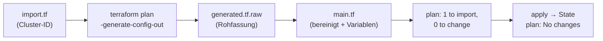

# Aufgabe 3 – Terraform-Import des Kubernetes-Clusters

> **Modul:** Orchestrierung & Observability · **Aufgabe 3**
> **Ort:** `vsc-ops/terraform/` · Details zu allen Terraform-Dateien: [terraform.md](terraform.md)

## Worum geht's?

Der Cluster `teko-doks` wurde ursprünglich per `doctl` (Befehl) erstellt. Terraform soll
ihn jetzt **als Code** beschreiben – **ohne ihn neu zu bauen**. Dafür wird er importiert:
Terraform liest den echten Zustand, erzeugt daraus eine Rohkonfiguration, diese wird
bereinigt, bis `terraform plan` **keine Änderungen** mehr zeigt.



## Kriterien → wo erfüllt

| Kriterium | Wo |
| --- | --- |
| DigitalOcean-Provider konfiguriert | `versions.tf` – `digitalocean/digitalocean ~> 2.0`, Token aus `var.do_token` |
| Import-Block + `-generate-config-out` | `import.tf` → Rohfassung liegt als `generated.tf.raw` bei |
| `generated.tf` analysiert und bereinigt | `main.tf` (Tabelle unten) |
| Wiederverwendbare Werte als Variablen | `variables.tf` (Definition) + `terraform.tfvars` (Werte) |
| API-Token nicht im Repo | nur `$env:TF_VAR_do_token`, Variable `sensitive = true`; State per `.gitignore` ausgeschlossen |
| `fmt` / `validate` fehlerfrei, `plan` ohne Änderungen | siehe [Nachweis](#nachweis) |

## Bereinigung: `generated.tf.raw` → `main.tf`

| In der Rohfassung | Entscheidung | Grund |
| --- | --- | --- |
| `node_count = 0` | → `var.node_count` (3) | **ein `apply` hätte alle Worker-Nodes entfernt** |
| 8 Plugin-Blöcke mit `enabled = false` (GPU, RDMA, …) | entfernt | ungenutzt; zwei GPU-Paare schliessen sich aus → 4 Validierungsfehler |
| `= null`, leere `tags` / `labels` | entfernt | bedeutungslos |
| `vpc_uuid`, `worker_subnet_uuid`, `cluster_subnet`, `service_subnet` | entfernt | vergibt DigitalOcean automatisch |
| `min_nodes` / `max_nodes` | entfernt | nur bei `auto_scale = true` relevant |
| Name, Region, Version, Pool-Name/-Grösse/-Anzahl | → Variablen | wiederverwendbar |
| `ha`, `auto_upgrade`, `surge_upgrade`, `maintenance_policy`, `coredns_autoscaler` | behalten | bewusste Cluster-Einstellungen |

Zusätzliche Absicherung: `variable "node_count"` hat eine Validierung `>= 1`.

## Nachweis

```powershell
cd terraform
$env:TF_VAR_do_token = "dop_v1_…"   # nur im aktuellen Fenster, nie in einer Datei
terraform fmt -check                 # keine Ausgabe = korrekt formatiert
terraform validate                   # Success! The configuration is valid.
terraform plan                       # No changes. Your infrastructure matches the configuration.
```

Beim erstmaligen Import zeigte `plan`: `Plan: 1 to import, 0 to add, 0 to change, 0 to destroy.`

## Stolpersteine

- **PowerShell** zerlegt `-generate-config-out=generated.tf` am Punkt → ganzes Argument in
  Anführungszeichen: `terraform plan "-generate-config-out=generated.tf"`.
- Beim **Generieren** braucht der `import`-Block `provider = digitalocean`, sonst sucht
  Terraform `hashicorp/digitalocean`. Sobald `main.tf` existiert, muss die Zeile wieder raus.
- `generated.tf` und `main.tf` dürfen nicht gleichzeitig als `.tf` existieren
  („Duplicate resource") → Rohfassung als `.raw` behalten.
- **Neuaufbau per `doctl`** = neue Cluster-ID → `cluster_id` in `terraform.tfvars`
  anpassen, alten State entfernen, erneut importieren.
- Der **State** (`terraform.tfstate`) enthält Admin-Zugang und DB-Passwörter → liegt nur
  lokal, wird nie committet.
