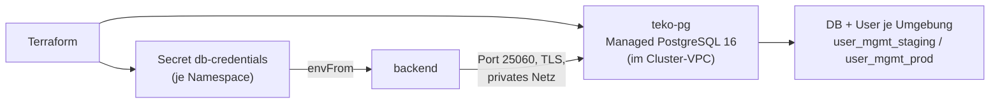

# Aufgabe 4 – Managed PostgreSQL statt Datenbank-Pod

> **Modul:** Orchestrierung & Observability · **Aufgabe 4**
> **Ort:** `vsc-ops/terraform/` (Datenbank + Secret) · `vsc-ops/helm/` (Anwendung)
> Details zu den Terraform-Dateien: [terraform.md](terraform.md)

## Worum geht's?

Die PostgreSQL lief bisher als **Pod mit PVC im Cluster**. Jetzt ist sie eine
**DigitalOcean Managed Database**, angelegt per Terraform. Die Verbindungsdaten schreibt
Terraform direkt als **Kubernetes-Secret** in die App-Namespaces – das Passwort erzeugt
DigitalOcean, es steht nirgends im Git.



## Kriterien → wo erfüllt

| Kriterium | Wo |
| --- | --- |
| Managed PostgreSQL ersetzt DB im Cluster | `terraform/database.tf` – Instanz `teko-pg` (PostgreSQL 16, `db-s-1vcpu-1gb`, im Cluster-VPC) |
| Verbindung nur über bereitgestellte Daten | Secret `db-credentials` → `helm/templates/backend.yaml` (`envFrom`); alte DB-Werte aus `helm/values.yaml` entfernt |
| Zugangsdaten per Secret, nicht hardcodiert | `terraform/secrets.tf` (`kubernetes_secret_v1`) |
| DB-Pod, Service und PVC entfernt | `helm/templates/db.yaml` gelöscht, `db:`-Blöcke aus allen `values*.yaml` entfernt |
| Per Terraform über DigitalOcean-Provider | `terraform/database.tf` + `secrets.tf` |

## Wo liegt was?

| Datei | Inhalt |
| --- | --- |
| `terraform/database.tf` | Instanz, je eine Datenbank + Benutzer pro Umgebung, `GRANT` auf Schema `public` |
| `terraform/secrets.tf` | Secret `db-credentials`: `SPRING_DATASOURCE_URL` / `_USERNAME` / `_PASSWORD` |
| `helm/templates/backend.yaml` | Backend liest `db-credentials` per `envFrom` |
| `helm/templates/networkpolicy.yaml` | `allow-postgres`: nur das Backend darf ausgehend auf Port 25060 |
| `helm/values.yaml` | Hikari-Pool (2 Verbindungen je Pod), `networkPolicy.database.postgresCidr` |

Die JDBC-URL zeigt auf den **privaten** Hostnamen mit `sslmode=require` – die Verbindung
verlässt das DigitalOcean-VPC nie und ist verschlüsselt.

## Nachweis

```powershell
kubectl get pods -n user-mgmt-prod                  # kein db-…-Pod mehr
kubectl get pvc -A                                  # kein db-pvc mehr
kubectl get secret db-credentials -n user-mgmt-prod # DATA 3
kubectl logs deploy/backend -n user-mgmt-prod | Select-String "HikariPool"
#   -> HikariPool-1 - Start completed  (Verbindung zur Managed DB steht)
cd terraform; terraform plan                        # No changes.
```

## Stolpersteine

- **PostgreSQL ≥ 15:** Neue Benutzer dürfen im Schema `public` keine Tabellen anlegen →
  `postgresql_grant` (CREATE, USAGE), sonst scheitert Hibernate beim Start.
- **Leerer `settings {}`-Block:** Die DO-API liefert ihn für DB-Benutzer mit → ohne
  `lifecycle { ignore_changes = [settings] }` zeigt jeder `plan` eine Schein-Änderung.
- **NetworkPolicy:** `allow-same-namespace` sperrt ausgehenden Verkehr → ohne
  `allow-postgres` erreicht das Backend die Datenbank nicht.
- **Verbindungslimit:** Die kleinste Instanz erlaubt ca. 22 Verbindungen – für **alle**
  Backend-Pods beider Umgebungen zusammen. Mit dem Standard-Pool (10 je Pod) starteten neue
  Pods nicht mehr (`remaining connection slots are reserved …`). Lösung:
  `SPRING_DATASOURCE_HIKARI_MAXIMUMPOOLSIZE=2` → max. 9 Pods × 2 = 18.
- **Daten:** Die alte Datenbank wurde nicht migriert. Die neue startete leer, Hibernate
  legt die Tabellen an.
- **Kosten:** Die Datenbank läuft unabhängig vom Cluster weiter – beim Abbau mitlöschen
  (`terraform destroy`).
