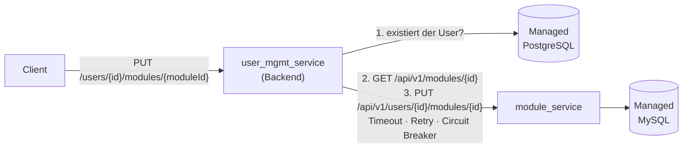

# Aufgabe 6 – module_service: Modulzuweisung über REST

> **Modul:** Orchestrierung & Observability · **Aufgabe 6**
> **Repos:** [`MikeGarda/user_mgmt_service`](https://github.com/MikeGarda/user_mgmt_service) (Code, Pipelines) ·
> [`MikeGarda/vsc-ops`](https://github.com/MikeGarda/vsc-ops) (Deployment, Terraform, Monitoring)

## Worum geht's?

Einem User kann ein **Modul** zugewiesen werden. Die Module verwaltet ein eigener Dienst,
der **module_service** (Python/FastAPI) mit eigener **Managed MySQL**. Der
user_mgmt_service prüft vor der Zuweisung per REST, ob das Modul existiert, und lässt die
Zuweisung dann vom module_service speichern. Der Aufruf ist gegen Ausfälle abgesichert
(Timeout, Retry, Circuit Breaker).

Das Backend kennt **nur die API** des module_service: Es hat keine MySQL-Zugangsdaten, und
nur der module_service darf per NetworkPolicy zur MySQL (siehe Hinweis unten).

## Kriterien → wo erfüllt

| Kriterium | Wo |
| --- | --- |
| Neuer Endpoint für die Zuweisung | App: `UserModuleController` → `PUT /users/{id}/modules/{moduleId}` |
| Vorher Verfügbarkeit per API prüfen | App: `ModuleAssignmentService` → `ModuleServiceClient.ensureModuleAvailable()` |
| REST über K8s-Service, Timeout/Retry/Circuit Breaker | App: `ModuleServiceClientConfig`; Adresse `MODULE_SERVICE_URL=http://module-service:8080` (Ops: `helm/values.yaml`) |
| Kein Backend-Zugriff auf die MySQL | Ops: Secret `module-service-db` nur im module_service; NetworkPolicy `allow-mysql` nur für `app=module_service` (Hinweis unten) |
| E2E fehlerfrei, passende Statuscodes | App: `ModuleExceptionHandler`, `CustomGlobalExceptionHandler`; Test `e2e/assign-module.ps1` |
| Telemetrie per ServiceMonitor + Dashboard | module_service: `app/metrics.py`; Ops: `servicemonitor-module-service.yaml`, `grafana-dashboard-module-service.yaml` |
| CPU/Memory-Limits unter Last (vertikal) | Ops: `values-staging.yaml` / `values-prod.yaml` (`module_service.resources`); Lasttest `k6/k6-module-service.yaml` |
| Erfüllt die ClusterPolicies | Ops: `module-service.yaml` (Probes, Requests/Limits, festes Image-Tag) |
| GitOps + Pipeline baut das Image | App: `.github/workflows/deploy-staging.yaml` / `deploy-prod.yaml` |

## Wo liegt was?

**App-Repo `user_mgmt_service`**

| Pfad | Inhalt |
| --- | --- |
| `src/main/java/com/example/jwt/domain/modules/` | Controller, Service, REST-Client, Resilience-Konfiguration, Exceptions |
| `build.gradle` | Resilience4j 2.3.0 (circuitbreaker, retry, micrometer) |
| `src/main/resources/application.properties` | `module-service.url`, Timeouts |
| `module_service/app/` | FastAPI-Dienst: `api.py` (Endpunkte), `bootstrap.py` (Tabellen + 4 Stamm-Module beim Start), `health.py`, `metrics.py`, `database.py` (TLS) |
| `module_service/Dockerfile` | installiert alles beim Build, startet `uvicorn` direkt (keine Downloads zur Laufzeit) |
| `e2e/assign-module.ps1`, `e2e/circuit-breaker.ps1` | End-to-End- und Circuit-Breaker-Test |
| `.github/workflows/deploy-*.yaml` | bauen Backend, Frontend **und** module_service, promoten die Tags |

**Ops-Repo `vsc-ops`**

| Pfad | Inhalt |
| --- | --- |
| `helm/templates/module-service.yaml` | Deployment + Service (Port `web`), Schalter `module_service.enabled` |
| `helm/templates/servicemonitor-module-service.yaml` | Prometheus scrapt `/metrics` |
| `helm/templates/networkpolicy.yaml` | `allow-mysql` (nur module_service → MySQL), `allow-monitoring` (Prometheus → module_service) |
| `monitoring/grafana-dashboard-module-service.yaml` | Dashboard „module_service" |
| `terraform/mysql.tf`, `terraform/secrets.tf` | Managed MySQL 8.4 + Secret `module-service-db` (siehe [terraform.md](terraform.md)) |
| `k6/k6-module-service.yaml` | Kyverno-konformer Lasttest gegen den module_service |

## Absicherung der REST-Kommunikation

| Mechanismus | Einstellung | Wirkung |
| --- | --- | --- |
| **Timeout** | Verbindung 2 s, Antwort 2 s | hängender Dienst blockiert keine Threads |
| **Retry** | 3 Versuche, Pause 300 ms → 600 ms | nur bei Timeout, Verbindungsfehler, 5xx – **nie** bei 404 |
| **Circuit Breaker** | ≥ 50 % Fehler in 10 Aufrufen (min. 5) → 15 s offen, dann 2 Probe-Aufrufe | ausgefallener Dienst wird nicht mehr angefragt → sofort 503 |

Retry ist gefahrlos, weil die Zuweisung per `PUT` **idempotent** ist. Jede Backend-Instanz
hat ihren eigenen Circuit Breaker. Zustand in Prometheus:
`resilience4j_circuitbreaker_state{name="moduleService"}`.

## Statuscodes

| Code | Bedeutung |
| --- | --- |
| `204` | Modul zugewiesen (auch wiederholt) |
| `400` | ID ist keine gültige UUID |
| `403` | nicht eingeloggt oder fremder User ohne `USER_MODIFY` |
| `404` | `USER_NOT_FOUND` oder `MODULE_NOT_FOUND` |
| `502` | unerwartete Antwort vom module_service |
| `503` | module_service nicht erreichbar oder Circuit Breaker offen |

## Nachweise

| Test | Ergebnis |
| --- | --- |
| `e2e/assign-module.ps1` gegen Staging **und** Prod | 8/8 OK (204, 204, 404, 403, 400, 403) |
| `e2e/circuit-breaker.ps1`, module_service gestoppt | Aufruf 1: `503` nach 3,8 s („nicht erreichbar", 3 Versuche); ab Aufruf 2: `503` „gesperrt (Circuit Breaker offen)"; nach Neustart + 15 s wieder `204` |
| Prometheus Target `module-service` | `UP` |
| Lasttest `k6-module-service` (bis 60 VUs) | siehe unten |
| `kubectl get policyreport -n user-mgmt-staging` | module_service: `PASS 4`, `FAIL 0` |

**Lasttest – vertikale Skalierung (Staging, gleicher Lauf, Limit während des Tests angehoben):**

| Unter Peak-Last | CPU-Limit 250m (vorher) | CPU-Limit 1 Kern (nachher) |
| --- | --- | --- |
| CPU-Verbrauch | gedeckelt bei 0,25 Kernen, ~100 % Drosselung | ~0,9 Kerne |
| Durchsatz | ~20 req/s | ~100 req/s |
| Response Time p95 | bis ~4,7 s | ~0,7 s |
| Memory | ~130 Mi | ~130 Mi (Limit 256 Mi) |
| Fehler / Restarts | 0 / 0 | 0 / 0 |

Festgelegt: **Request 250m / 128Mi, Limit 1 Kern / 256Mi.** Mehr als ~1 Kern bringt nichts,
weil `uvicorn` ein einzelner Python-Prozess ist – weitere Last wird horizontal abgefangen
(Prod: 2 Replicas).

**Hinweis zur Netzwerk-Trennung:** Beide Datenbanken nutzen Port 25060. `allow-postgres`
erlaubt dem Backend derzeit das ganze private Netz (`networkPolicy.database.postgresCidr:
10.0.0.0/8`) – technisch könnte es die MySQL-IP also erreichen, scheitert aber an den
fehlenden Zugangsdaten. Für eine **strikte** Trennung `postgresCidr` (und `mysqlCidr`) auf
die private IP der jeweiligen Datenbank als `/32` setzen. Die IP lässt sich nur im VPC
auflösen, z. B. mit
`kubectl exec deploy/frontend -n user-mgmt-staging -- nslookup <private-host>`.

## Stolpersteine

- `uv run` lud beim Start Pakete aus dem Internet – die NetworkPolicy blockt das zu Recht
  → Dockerfile installiert alles beim Build.
- Managed MySQL erzwingt TLS → `database.py` aktiviert TLS in PyMySQL.
- `prometheus-fastapi-instrumentator` stürzt mit aktuellem FastAPI ab → eigene
  Middleware in `app/metrics.py`.
- `yq` in der Pipeline: Schlüssel heisst `module_service` (Unterstrich), nicht `module-service`.
- `module_service` war nur in Staging definiert → Prod-Chart liess sich nicht rendern
  → Schalter `module_service.enabled`.
- Ungültige ID lieferte 403 statt 400 (interner Umweg über `/error`) → eigener
  Exception-Handler.
- MySQL-Version `"8"` wird von DigitalOcean abgelehnt → `8.4`
  (`doctl databases options versions`).
