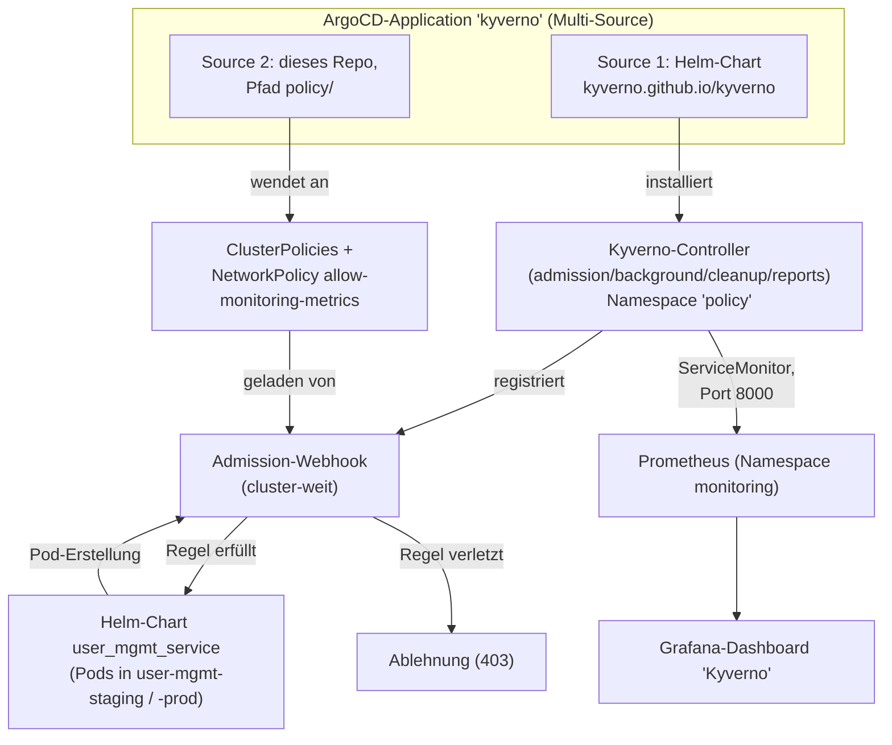

# Kyverno – Policy Enforcement (Aufgabe 5)

> **Modul:** Orchestrierung & Observability · **Aufgabe 5**
> **Repository:** [`MikeGarda/vsc-ops`](https://github.com/MikeGarda/vsc-ops) (alle Kyverno-Manifeste)
> **Werkzeug:** [Kyverno](https://kyverno.io/) (Helm-Chart `3.9.1`), installiert im dedizierten Namespace `policy`

Kurzüberblick, wie Policy-Enforcement für den `user_mgmt_service` per Kyverno
umgesetzt ist.

## 1. Zweck

Kyverno ist eine Kubernetes-native Policy-Engine. Sie hängt sich als
**Admission-Webhook** in den API-Server und prüft **jedes** Pod-Objekt im
Cluster (nicht nur die von diesem Service) beim Erstellen gegen deklarative
`ClusterPolicy`-Regeln. Verstösst ein Manifest gegen eine Regel, wird es mit
`validationFailureAction: Enforce` **abgelehnt**, bevor der Pod überhaupt
geplant wird.

## 2. Betroffene Dateien

| Datei | Zweck |
| --- | --- |
| `application-kyverno.yaml` | ArgoCD-`Application` (Multi-Source): installiert das Kyverno-Helm-Chart **und** synct den Ordner `policy/` in denselben Namespace |
| `policy/disallow-latest-tag.yaml` | `ClusterPolicy` – verbietet den Image-Tag `:latest` |
| `policy/require-probes.yaml` | `ClusterPolicy` – erzwingt `livenessProbe` + `readinessProbe` |
| `policy/require-request-limits.yaml` | `ClusterPolicy` (`require-requests-limits`) – erzwingt CPU-/Memory-`requests` und `-limits` |
| `policy/allow-monitoring-metrics.yaml` | `NetworkPolicy` – erlaubt Prometheus (Namespace `monitoring`) das Scrapen der Kyverno-Metrik-Ports (8000), da Kyverno selbst keine eigene NetworkPolicy mitbringt |
| `setup-gitops.sh` / `setup-gitops.ps1` | Bootstrap: wenden `application-kyverno.yaml` beim Ersteinrichten des Clusters an |
| `monitoring/grafana-dashboards.yaml` | Enthält das vorgefertigte Kyverno-Grafana-Dashboard (Panel `Kyverno`, PromQL auf `kyverno_policy_results_total`, `kyverno_admission_requests_total`, …) |
| `README.md` | Abschnitt „Aufgabe 5“ – Checkliste der Anforderungen |

## 3. Wie es zusammenhängt



- **Installation**: `application-kyverno.yaml` ist eine ArgoCD-`Application`
  mit **zwei Quellen**. Quelle 1 installiert das offizielle Kyverno-Helm-Chart
  in den Namespace `policy` und aktiviert für alle vier Controller
  (`admission-`, `background-`, `cleanup-`, `reports-controller`) je einen
  `ServiceMonitor`. Quelle 2 wendet den Ordner `policy/` aus **diesem** Repo
  an – dort liegen die eigentlichen `ClusterPolicy`-Objekte.
- **Enforcement**: `ClusterPolicy` ist cluster-weit gültig, es braucht keine
  Bindung an einen bestimmten Namespace. Sobald ein Pod – egal ob in
  `user-mgmt-staging`, `user-mgmt-prod` oder anderswo – erstellt wird, prüft
  der `admission-controller` die drei Regeln (`disallow-latest-tag`,
  `require-probes`, `require-requests-limits`). Damit greift das
  Enforcement automatisch für **beide** Umgebungen/Pipelines, ohne dass die
  App-Pipelines etwas davon wissen müssen.
- **Monitoring-Integration**: Da das Kyverno-Chart standardmässig keine
  eigene `NetworkPolicy` mitbringt, öffnet `allow-monitoring-metrics.yaml`
  den Ingress vom Namespace `monitoring` auf Port `8000` der
  Kyverno-Pods – dieselbe Namespace-Freigabe, die auch beim
  `user_mgmt_service` für Prometheus-Scraping genutzt wird (siehe
  [`docs/Prometheus.md`](Prometheus.md)). Die `ServiceMonitor`-Objekte lassen
  Prometheus die Kyverno-Metriken einsammeln; das mitgelieferte
  Grafana-Dashboard in `monitoring/grafana-dashboards.yaml` visualisiert u. a.
  Policy-Pass-Rate und Admission-Request-Rate.
- **Bootstrap**: `setup-gitops.sh`/`.ps1` wenden `application-kyverno.yaml`
  bei der Ersteinrichtung zusammen mit den übrigen ArgoCD-Applications an.

## 4. Verifikation

```bash
# Sync-Status prüfen
kubectl -n argocd get application kyverno

# Absichtlich ungültiges Manifest testen (verstösst gegen alle 3 Policies)
kubectl run bad-pod --image=nginx:latest -n user-mgmt-staging --dry-run=server
# -> erwartete Antwort: Ablehnung durch Kyverno mit den Regel-Meldungen
#    aus disallow-latest-tag / require-probes / require-requests-limits

# Aktive ClusterPolicies anzeigen
kubectl get clusterpolicy
```
